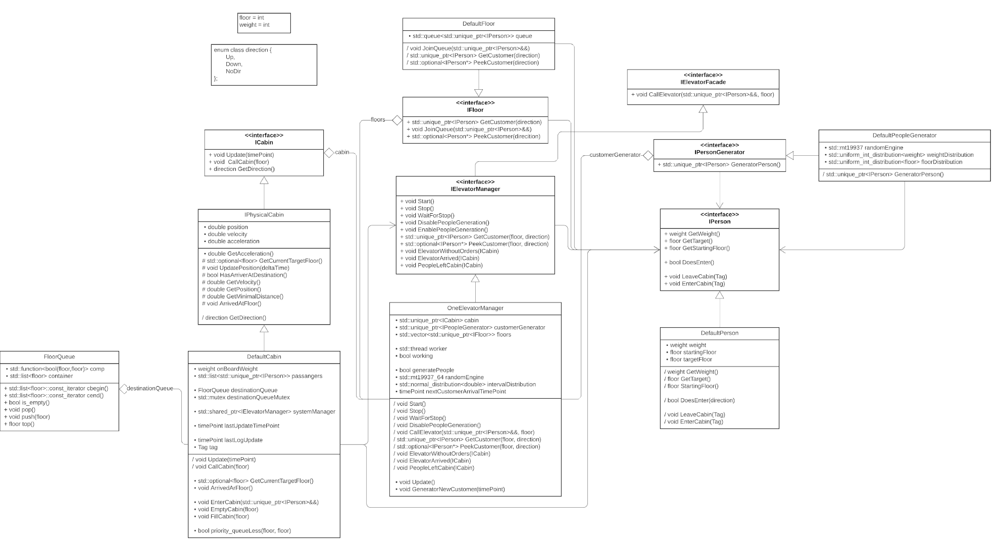

# Projekt na Programowanie Obiektowe
## Kompilacja
W celu skompilowania biblioteki należy użyć `make compile-lib`.

## Użycie
W celu użycia programu należy ustawić parametry symulacji w pliku `Projekt.cpp` (każdy parametr jest opisany nazwą zmiennej tak dobrze, jak tylko da się używając tekstu).
Następnie użyć komendy `make sim`.

> System Operacyjny - testowane na Windows 10 i wsl-linux

## Przewodnik po kodzie
### ObjectFactory
ObjectFactory - Klasa zawierająca metody statyczne. 
Służy do oddawania obiektów danej implementacji typu obiektu (zgodnie z wzorcem fabryki).
Poza tym przechowuje stałe (nie koniecznie) sterujące symulacją.

### IElevatorManager
IElevatorManager - interface managera systemu, mającego za zadanie zarządzanie kabinami, przechowywanie tablicy pięter i w tej implementacji generowanie klientów.

#### Teraźniejsza implementacja - OneElevatorManager
Klasa dzieniczy po IElevatorManager.
Obiekt OneElevatorManager jest konstruowany, i po użyciu `Start()` na oddzielny rdzeń wykonuje `Update()`.
`Update()` wykonuje w pętli:
- Jeżeli minął ustalony czas wygeneruj nowego klienta
- wykonaj `cabin->Update()`

Jeśli w którymś momencie cabina jest bez rozkazów, symulacja się kończy (w tej implementacji - nie wymagane).

Po wyjściu z pętli Loguje wiadomość o zakończeniu symulacji.

Interface udostępnia eventy takie jak `ElevatorWithoutOrders`, `ElevatorArrived`, `PeopleLeftCabin`.
`ElevatorWithoutOrders` - w tej implementacji kończy symulację.
`ElevatorArrived` i PeopleLeftCabin w tej implementacji nie są wykorzystane.

### ICabin
ICabin - interface reprezentujący kabinę windy mający za zadanie przyjęcie klienta z piętra A i zawiezienie go na piętro B.

### IPhysicalCabin
Klasa dzieniczy po ICabin.
IPhysicalCabin - interface mający za zadanie obsłużyć fizyczną część przemieszczania się po piętrach. Obsługuje pozycje, prędkość, przyspieszenie i wszystko z tym związane. 
Oferuje:
- `UpdatePosition()`, które powinno być wywołane tak często jak to możliwe
- `HasArrivedAtDestination()`, które mówi czy winda dotarła do celu.
- `GetMinimalDistance()`, które odpowiada na pytanie Ile przejedzie kabina która zacznie zwalniać z maksymalną prędkością w tym momencie.

Wymaga od klasy dziedziczącej funkcji `GetCurrentTargetFloor()`.

#### Teraźniejsza implementacja - DefaultCabin
Klasa dzieniczy po IPhysicalCabin.
Obiekt przechowuje zbiór klientów i kolejkę pięter do odwiedzenia.
Oferuje:
- `Update()`, które wywołuje `UpdatePosition()` (jeżeli winda ma gdzie jechać), oraz jeśli winda dojechala do celu wywołuje wewnętrzną funkcję `ArrivedAtFloor()`, która obsługuje tą sytuację (loguje również fizyczne parametry cabiny).
- `ArrivedAtFloor()`, które wywołuje ewent `ElevatorArrived`, potem wypuszcza pasażerów przy użyciu wewnętrznej funkcji `EmptyCabin()`, następnie wpuszcza pasażerów chętnych do wejścia do tej kabiny przy użyciu wewnętrznej funkcji `FillCabin()`.
- `CallCabin()`, która działa jak wciśnięcie przycisku do zawołania windy lub wewnątrz funkcji.

Funkcjonalność pozostałych funkcji jest na tyle oczywista, lub techniczna, że tłumaczenie mija się z celem, poza priority_queueLess które służy jako funkcja sortująca kolejkę.

### IPerson
IPerson - interface reprezentujący klienta.
Dostarcza:
- `DoesEnter()`, która mówi czy klient chce wejść do danej kabiny.
- `EnterCabin()`, która wykonuje reakcję na wejście do kabiny.
- `LeaveCabin()`, która wykonuje reakcję na wyjście z kabiny.

#### Teraźniejsza implementacja - DefaultPerson
Klasa dziedziczy po IPerson.
- `DoesEnter()`, wchodzi do każdej windy, która jedzie w stronę w którą on chce jechać.
- `EnterCabin()`, wchodzenie do wincy trwa pół sekundy.
- `LeaveCabin()`, wychodzenie z windy trwa pół sekundy.

### IFloor
IFloor - interface reprezentujący piętro, przechowujące klientów siedzących i czekających na windę na danym piętrze. 
Dostarcza:
- `JoinQueue()`, która dodaje klienta do kolejki.
- `GetCustomer()`, która oddaje pierwszego klienta z kolejki.
- `PeekCustomer()`, która pokazuje jaki klient jest pierwszy w kolejce.

#### Teraźniejsza implementacja - DefaultFloor
Oferuje domyślną implementację tego założenia.

### IPeopleGenerator
IPeopleGenerator - interface klasy dostarczającej generator klientów.
Dostarcza:
- `GeneratePerson()`, która zwraca wygenerowanego klienta.

#### Teraźniejsza implementacja - DefaultPeopleGenerator
Oferuje domyślną implementację tego założenia.

### FloorQueue
Niestandardowa implementacja kolejki sortowanej.

## Class Diagram
> Dla lepszej jakości zobaczyć [ClassDiagram.jpeg](ClassDiagram.jpeg)

